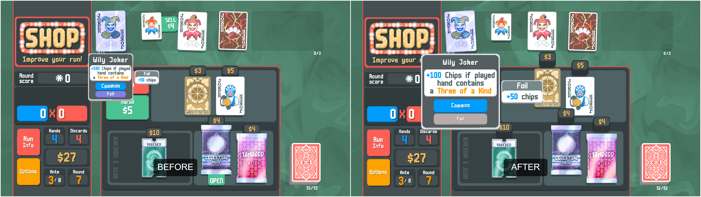
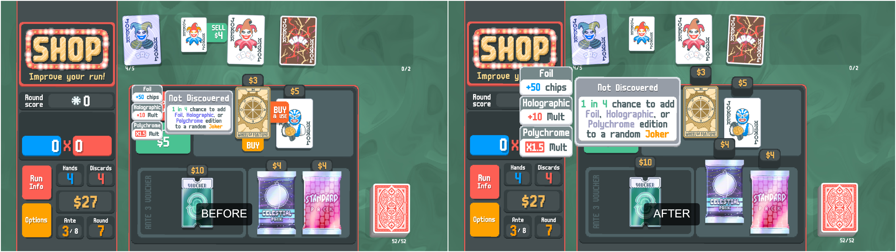
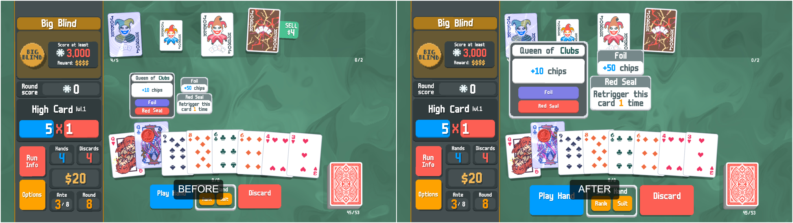

# Zoomer UI Mod for Balatro

> Make your UI bigger, better, and easier to see — especially for mobile and small-screen users.

  
  
  
*A comparison of default UI vs. scaled UI using Zoomer.*

 
*Configurable settings*
---

## 📦 Overview

**Zoomer** is a simple and customizable mod for **Balatro** that enlarges key UI components such as tooltips, buttons, and menus.  
Ideal for Steam Deck, mobile, or anyone who prefers a more readable and accessible interface.

---

## 🎮 Features

- 📐 **UI Scaling Options**:
  - Tooltip scaling
  - Game button scaling
  - Main menu scaling
  - Buy/sell/use button scaling

- ⚙️ **Fully configurable via in-game menu**
- 🌍 **Multilingual support** (see below)
- 🤝 Recommended: [MobLikeDragging](https://www.nexusmods.com/balatro/mods/133) for smoother card movement

---

## 🛠️ Installation

1. Install the **Steamodded (Smods)** [BepInEx](https://www.nexusmods.com/balatro/mods/45).
2. Drop the `Zoomer` mod folder into `C:\Users\yourname\AppData\Roaming\Balatro\Mods` directory.
3. Launch the game and adjust the settings from the in-game config tab.
4. (Optional) Restart or change interface view for settings to fully apply.

---

## 🌐 Translations

Zoomer supports the following languages:

- 🇬🇧 English
- 🇹🇼 繁體中文 (zh-TW)
- 🇨🇳 简体中文 (zh-CN)
- 🇯🇵 日本語
- 🇰🇷 한국어
- 🇪🇸 Español (es-ES / es-419)
- 🇫🇷 Français
- 🇩🇪 Deutsch
- 🇮🇹 Italiano
- 🇵🇹 Português (Brasil)
- 🇷🇺 Русский
- 🇮🇩 Bahasa Indonesia
- 🇻🇳 Tiếng Việt
- 🇳🇱 Nederlands

---

## 📝 License

MIT License  
Feel free to use, modify, and distribute — just give credit if you do!

---
